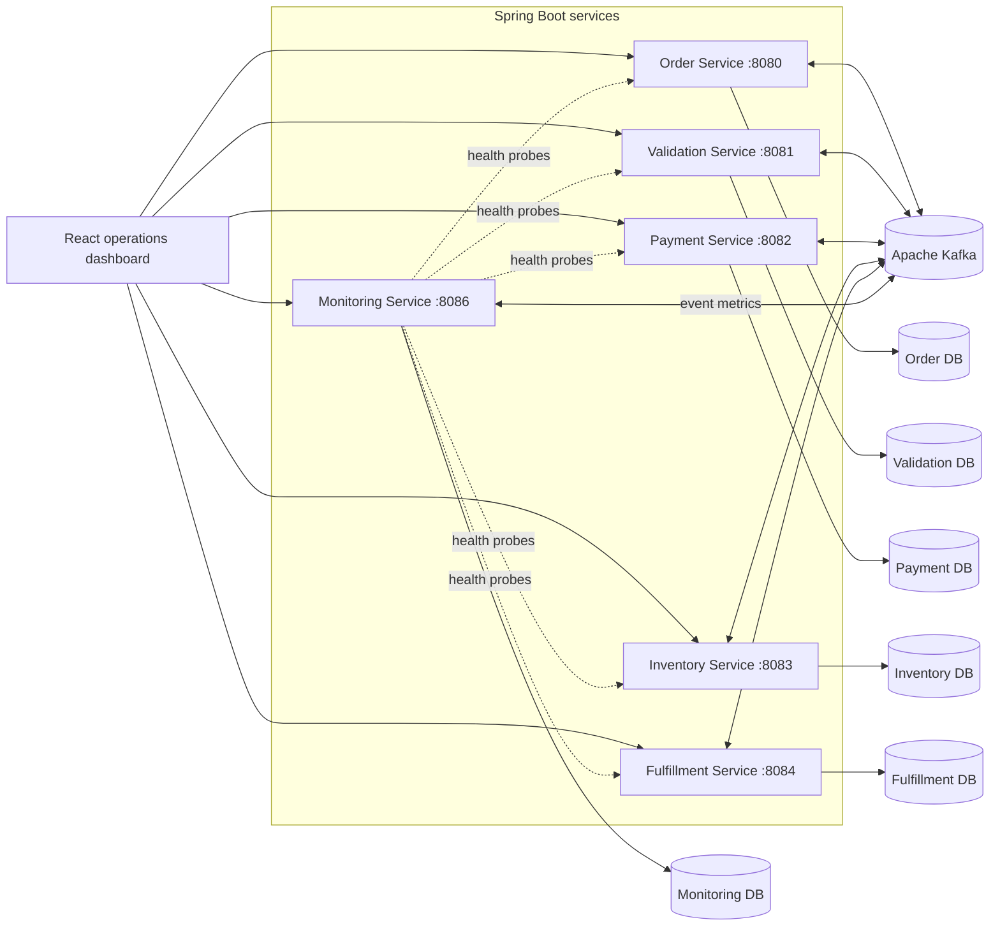
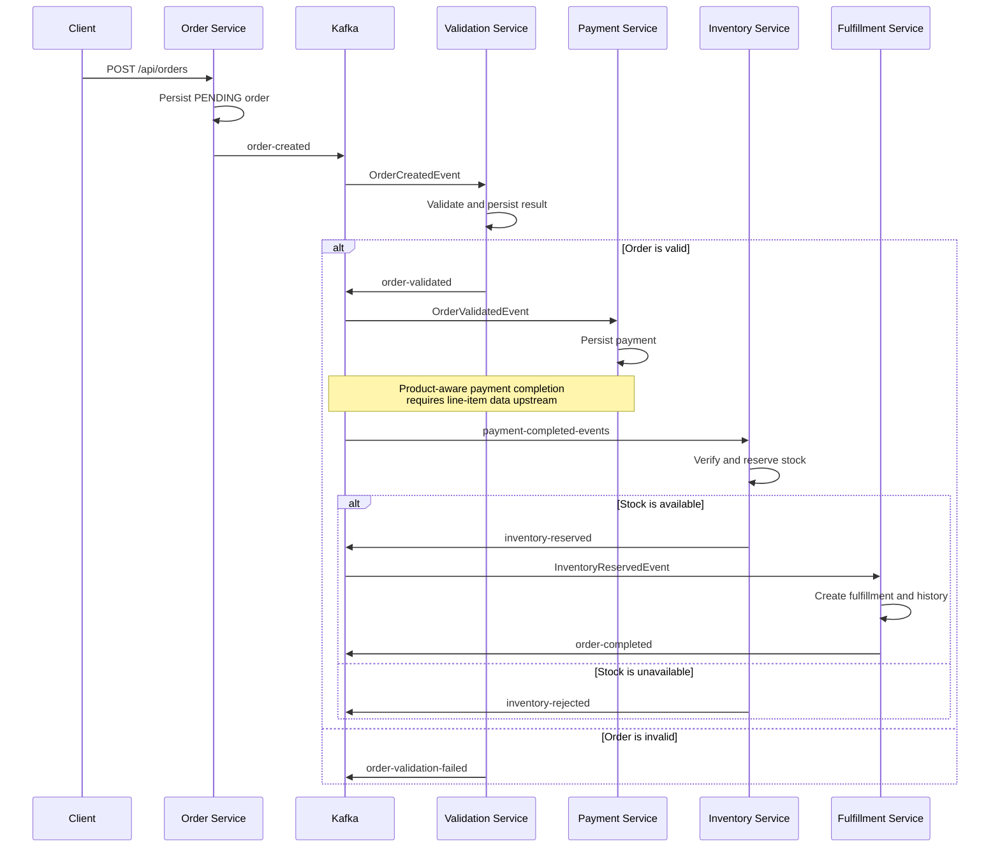

# Distributed Order Processing System

An event-driven order-processing platform built as a collection of Spring Boot microservices with Apache Kafka, PostgreSQL, and a React operations dashboard. The project demonstrates asynchronous service coordination, database-per-service persistence, idempotent event handling, retry processing, dead-letter queues, replay tooling, audit history, and operational monitoring.

> [!NOTE]
> This repository is designed for development and demonstration. Review the security, resilience, observability, and infrastructure recommendations in [Future enhancements](#future-enhancements) before using it in production.

## Table of contents

- [Project overview](#project-overview)
- [System architecture](#system-architecture)
- [Tech stack](#tech-stack)
- [Features](#features)
- [Project structure](#project-structure)
- [Microservices overview](#microservices-overview)
- [Kafka topics](#kafka-topics)
- [API overview](#api-overview)
- [Event flow](#event-flow)
- [Prerequisites](#prerequisites)
- [Setup and installation](#setup-and-installation)
- [Running with Docker Compose](#running-with-docker-compose)
- [Environment variables](#environment-variables)
- [Testing](#testing)
- [Monitoring](#monitoring)
- [Future enhancements](#future-enhancements)

## Project overview

The system separates the order lifecycle into independently deployable services. Each business service owns its PostgreSQL database and communicates with other services through Kafka events. The frontend provides operational views for orders, validation, payment, inventory, fulfillment, retries, failed events, replay, idempotency, audit history, and monitoring.

The principal domain sequence is:

1. Accept and persist an order.
2. Publish an order-created event.
3. Validate the order asynchronously.
4. Process payment for a valid order.
5. Reserve inventory after payment completion.
6. Create fulfillment after inventory reservation.
7. Publish order completion.

Supporting workflows record duplicate-event decisions, retry attempts, exhausted events, replay requests, audit entries, health information, and performance metrics.

## System architecture



### Architectural principles

- **Database per service:** each service owns its schema and Flyway migrations.
- **Asynchronous coordination:** Kafka events decouple lifecycle stages.
- **At-least-once handling:** consumers acknowledge records after processing decisions.
- **Idempotency:** consumed event IDs are recorded to suppress completed duplicates.
- **Failure recovery:** retry records, a shared DLQ topic, and service-scoped replay APIs support recovery.
- **Operational visibility:** audit and monitoring services expose lifecycle and health information.

## Tech stack

| Layer | Technology |
|---|---|
| Backend | Java 17, Spring Boot 3.2, Spring Web, Spring Data JPA |
| Messaging | Apache Kafka, Spring Kafka, ZooKeeper |
| Persistence | PostgreSQL 15, Hibernate, Flyway |
| Validation | Jakarta Bean Validation |
| Monitoring | Spring Boot Actuator, Micrometer, Prometheus registry |
| Frontend | React 18, React Router 6, Create React App |
| Testing | JUnit 5, Mockito, Spring Boot Test, Spring Kafka Test, Awaitility, Jest, Testing Library |
| Deployment | Docker, Docker Compose, Nginx |
| Serialization | Jackson JSON |

## Features

- REST API for order creation, retrieval, filtering, sorting, and pagination.
- Asynchronous order validation and validation-result events.
- Payment, inventory, and fulfillment persistence workflows.
- Inventory availability checks and pessimistic locking during reservation.
- Per-service idempotency records for event processing.
- Configurable retry records with scheduled retry attempts and exhaustion handling.
- Shared dead-letter topic with service-specific DLQ consumers.
- Type-safe replay of supported failed events to service-approved topics.
- Order lifecycle audit history.
- Health, application, throughput, latency, and failure metrics.
- React dashboard for business and operational data.
- Independent Flyway migrations and PostgreSQL databases.
- Containerized local environment with health checks and persistent volumes.

## Project structure

```text
distributed-order-processing-system/
|-- backend/
|   |-- common-lib/              # Shared events, DTOs, Kafka configuration, and utilities
|   |-- order-service/           # Order API, event producer, and lifecycle audit
|   |-- validation-service/      # Order validation, retry, DLQ, replay, and idempotency
|   |-- payment-service/         # Payment records and operational recovery APIs
|   |-- inventory-service/       # Stock management and inventory events
|   |-- fulfillment-service/     # Fulfillment records, history, and completion events
|   `-- monitoring-service/      # Health aggregation and event performance metrics
|-- frontend/
|   |-- public/
|   |-- src/
|   |   |-- components/          # Domain and shared UI components
|   |   |-- pages/               # Dashboard and operational pages
|   |   |-- services/            # Service-specific API clients
|   |   `-- shared/              # Shared hooks, API helpers, utilities, and components
|   |-- Dockerfile
|   `-- nginx.conf
|-- infrastructure/
|   |-- kafka/                   # Reserved infrastructure directory
|   `-- postgres/                # Reserved infrastructure directory
|-- docker-compose.yml           # Complete local stack
|-- .env.example                 # Deployment-oriented configuration reference
|-- simple-validation.ps1        # Lightweight validation helper
|-- validate-deployment.ps1      # Deployment validation helper
`-- validation-report.ps1        # Validation reporting helper
```

## Microservices overview

| Component | Port | Database | Responsibility |
|---|---:|---|---|
| Order Service | `8080` | `orderdb` | Creates and searches orders, publishes `order-created`, and stores audit events. |
| Validation Service | `8081` | `validationdb` | Consumes new orders, validates business rules, and publishes validation outcomes. |
| Payment Service | `8082` | `paymentdb` | Consumes validated orders and persists payment records. |
| Inventory Service | `8083` | `inventorydb` | Manages stock, consumes payment-completed events, and publishes reservation outcomes. |
| Fulfillment Service | `8084` | `fulfillmentdb` | Consumes inventory reservations, creates fulfillment records, stores history, and publishes completion. |
| Monitoring Service | `8086` | `monitoringdb` | Aggregates service health and calculates event throughput, latency, and failure metrics. |
| Frontend | `3000` | — | React operations dashboard served by Nginx in Docker. |
| Kafka | `9092` | — | Host-accessible event broker; containers use `kafka:29092`. |
| ZooKeeper | `2181` | — | Coordinates the development Kafka broker. |

The validation, payment, inventory, and fulfillment services also expose retry, DLQ, replay, and idempotency APIs.

## Kafka topics

| Topic | Producer or source | Consumers | Purpose |
|---|---|---|---|
| `order-created` | Order Service | Validation Service, Audit, Monitoring | Starts asynchronous order validation. |
| `order-validated` | Validation Service | Payment Service, Audit, Monitoring | Signals successful validation. |
| `order-validation-failed` | Validation Service | Audit, Monitoring | Records an invalid order outcome. |
| `payment-completed-events` | Replay API or an external/manual producer | Inventory Service, Audit, Monitoring | Starts inventory verification and reservation; the current payment service does not publish this topic. |
| `inventory-reserved` | Inventory Service | Fulfillment Service, Audit, Monitoring | Starts fulfillment for reserved stock. |
| `inventory-rejected` | Inventory Service | Audit, Monitoring | Reports inventory rejection or insufficient stock. |
| `order-completed` | Fulfillment Service | Audit, Monitoring | Signals completion of fulfillment. |
| `retry-orders` | Recovery services | Service-specific retry consumer groups | Carries retry envelopes for failed processing. |
| `dead-letter-orders` | Recovery services | Service-specific DLQ consumer groups | Stores events whose retry budget is exhausted. |

Kafka uses JSON values and string keys. Business services use distinct consumer groups, while audit and monitoring use their own groups so they can observe the complete event stream independently.

> [!IMPORTANT]
> The current order request contains customer and amount data but no product line items. Consequently, end-to-end generation of the product-specific `payment-completed-events` payload requires the upstream order contract to be extended. The topic, downstream inventory consumer, recovery flow, audit handling, and monitoring handling already exist.

## API overview

All examples use local Docker Compose ports. JSON request and response bodies use `Content-Type: application/json`.

### Order Service — `http://localhost:8080/api`

| Method | Endpoint | Description |
|---|---|---|
| `POST` | `/orders` | Create an order. |
| `GET` | `/orders` | List all orders. |
| `GET` | `/orders/{id}` | Get an order by database ID. |
| `GET` | `/orders/search` | Search orders with pagination and sorting. |
| `GET` | `/audit` | List paginated audit events. |
| `GET` | `/audit/order/{orderId}` | Get audit history for an order. |
| `GET` | `/audit/filter` | Filter audit events. |
| `GET` | `/audit/health` | Check the audit API. |

Create an order:

```bash
curl -X POST http://localhost:8080/api/orders \
  -H "Content-Type: application/json" \
  -d '{"customerId": 1001, "totalAmount": 149.99}'
```

Search parameters include `customerId`, `orderStatus`, `startDate`, `endDate`, `page`, `size`, `sortBy`, and `sortDirection`. Page sizes are limited to 1–100.

### Validation Service — `http://localhost:8081/api`

| Method | Endpoint | Description |
|---|---|---|
| `GET` | `/validations` | List validations; optionally filter with `orderId`. |
| `GET` | `/validations/{id}` | Get a validation by ID. |
| `GET` | `/retry` | List validation retry records. |
| `GET` | `/dlq` | List failed validation events. |
| `GET` | `/dlq/service/{serviceName}` | Filter failed events by service. |
| `GET` | `/idempotency` | List validation idempotency records. |
| `POST` | `/replay` | Replay an `ORDER_CREATED` failure to `order-created`. |

### Payment Service — `http://localhost:8082`

| Method | Endpoint | Description |
|---|---|---|
| `GET` | `/api/payments` | List payments. |
| `GET` | `/api/payments/{paymentId}` | Get a payment by its external payment ID. |
| `GET` | `/api/payments/order/{orderId}` | List payments for an order. |
| `GET` | `/api/retry` | List payment retry records. |
| `GET` | `/api/dlq` | List failed payment events. |
| `GET` | `/api/dlq/service/{serviceName}` | Filter failed payment events by service. |
| `GET` | `/api/idempotency` | List payment idempotency records. |
| `POST` | `/api/replay` | Replay an `ORDER_VALIDATED` failure to `order-validated`. |

### Inventory Service — `http://localhost:8083`

| Method | Endpoint | Description |
|---|---|---|
| `GET` | `/api/inventory` | List inventory records. |
| `POST` | `/api/inventory` | Create or update an inventory record. |
| `GET` | `/api/inventory/product/{productId}` | Get inventory by product ID. |
| `GET` | `/api/inventory/status/{status}` | List inventory by status. |
| `GET` | `/api/inventory/verify` | Verify availability using query parameters. |
| `GET` | `/api/retry` | List inventory retry records. |
| `GET` | `/api/dlq` | List failed inventory events. |
| `GET` | `/api/dlq/service/{serviceName}` | Filter failed inventory events by service. |
| `GET` | `/api/idempotency` | List inventory idempotency records. |
| `POST` | `/api/replay` | Replay a `PAYMENT_COMPLETED` failure to `payment-completed-events`. |

### Fulfillment Service — `http://localhost:8084`

| Method | Endpoint | Description |
|---|---|---|
| `GET` | `/api/fulfillments` | List fulfillment records. |
| `GET` | `/api/fulfillments/{id}` | Get a fulfillment by ID. |
| `GET` | `/api/fulfillments/order/{orderId}` | Get fulfillment for an order. |
| `GET` | `/api/fulfillments/customer/{customerId}` | List fulfillment records by customer. |
| `GET` | `/api/fulfillments/status/{status}` | List fulfillment records by status. |
| `GET` | `/api/fulfillments/{fulfillmentId}/history` | Get one fulfillment's history. |
| `GET` | `/api/fulfillments/history` | List all fulfillment history entries. |
| `GET` | `/api/retry` | List fulfillment retry records. |
| `GET` | `/api/dlq` | List failed fulfillment events. |
| `GET` | `/api/dlq/service/{serviceName}` | Filter failed fulfillment events by service. |
| `GET` | `/api/idempotency` | List fulfillment idempotency records. |
| `POST` | `/api/replay` | Replay an `INVENTORY_RESERVED` failure to `inventory-reserved`. |

### Monitoring Service — `http://localhost:8086`

| Method | Endpoint | Description |
|---|---|---|
| `GET` | `/api/monitoring/health` | Aggregated database, Kafka, and service health. |
| `GET` | `/api/monitoring/metrics` | JVM, system, HTTP, and application metrics. |
| `GET` | `/api/monitoring/performance-metrics?minutes=5` | Throughput, latency, and failure metrics. |
| `GET` | `/actuator/health` | Monitoring service health. |
| `GET` | `/actuator/prometheus` | Prometheus-format metrics. |

### Replay request

Replay endpoints accept the following shape. The service loads the event type and payload from the stored failed event, then restricts replay to its supported topic and event type.

```json
{
  "eventId": "failed-event-id",
  "replayTopic": "order-created"
}
```

## Event flow



### Retry, DLQ, and replay flow

1. A consumer catches a processing exception and creates a retry record containing the original payload, event class, target service, retry count, and next retry time.
2. Retry envelopes are published to `retry-orders`; service-specific consumers ignore envelopes belonging to another service.
3. Scheduled retry processing selects due records and attempts the operation again.
4. Retry intervals are selected from the shared retry configuration.
5. Exhausted events are published to `dead-letter-orders` and persisted by the owning service's DLQ consumer.
6. An operator can inspect failed events in the frontend and submit a replay request.
7. Replay validates the service-approved topic, restores the concrete event type, and republishes the event.

## Prerequisites

### Docker workflow

- Docker Engine 24+ or Docker Desktop
- Docker Compose v2
- At least 8 GB of available memory recommended for the complete stack
- Ports `2181`, `3000`, `5432`–`5437`, `8080`–`8084`, `8086`, `9092`, and `29092` available

### Local development

- Java Development Kit 17
- Apache Maven 3.9+
- Node.js 18+ and npm 9+
- PostgreSQL 15
- Kafka compatible with the included Spring Kafka version

## Setup and installation

1. Clone the repository and enter it:

   ```bash
   git clone <repository-url>
   cd distributed-order-processing-system
   ```

2. Optionally create a local environment file:

   ```bash
   cp .env.example .env
   ```

   On PowerShell:

   ```powershell
   Copy-Item .env.example .env
   ```

   The current Compose file hard-codes its service credentials, ports, URLs, and Kafka settings. Of the values in `.env.example`, Compose currently consumes only `COMPOSE_PROJECT_NAME`; copying the file does not override the other Compose values.

3. Review the effective development settings in `docker-compose.yml`. Use the variables documented under [Environment variables](#environment-variables) when starting Spring Boot services directly.

### Build backend services locally

Each backend component has its own Maven project. Install the shared library first:

```bash
cd backend/common-lib
mvn clean install
cd ../..
```

Then build the services:

```bash
for service in order-service validation-service payment-service inventory-service fulfillment-service monitoring-service; do
  (cd "backend/$service" && mvn clean package)
done
```

PowerShell equivalent:

```powershell
$services = @(
  'order-service',
  'validation-service',
  'payment-service',
  'inventory-service',
  'fulfillment-service',
  'monitoring-service'
)

Push-Location backend/common-lib
mvn clean install
Pop-Location

foreach ($service in $services) {
  Push-Location "backend/$service"
  mvn clean package
  Pop-Location
}
```

### Install and build the frontend

```bash
cd frontend
npm ci
npm run build
```

For frontend development:

```bash
npm start
```

## Running with Docker Compose

Start the entire platform:

```bash
docker compose up --build -d
```

Follow service logs:

```bash
docker compose logs -f
```

Inspect container health and status:

```bash
docker compose ps
```

The order and validation applications use the `/api` servlet context, so their actual Actuator health URLs are `/api/actuator/health`. Their current Compose health checks request `/actuator/health`; those two containers can therefore be reported as unhealthy even when their APIs are running. This does not prevent the remaining application containers from being created because they depend on those services with `service_started`, not `service_healthy`.

Once the containers are ready, open:

- Frontend: <http://localhost:3000>
- Order API: <http://localhost:8080/api/orders>
- Monitoring API: <http://localhost:8086/api/monitoring/health>
- Prometheus metrics: <http://localhost:8086/actuator/prometheus>

Stop containers without deleting persisted database data:

```bash
docker compose down
```

To remove containers and named PostgreSQL volumes:

```bash
docker compose down -v
```

> [!WARNING]
> The `-v` option permanently deletes the local database volumes and their data.

## Environment variables

Spring Boot reads the variables below when services are launched directly, and Compose explicitly supplies a subset of them to each container. The checked-in `.env.example` is mostly a deployment-oriented reference: the current `docker-compose.yml` does not interpolate its database, port, Kafka, service URL, JVM, profile, logging, or frontend entries. Only the standard Compose variable `COMPOSE_PROJECT_NAME` affects the current Compose project.

### Core service variables

| Variable | Example | Description |
|---|---|---|
| `DB_URL` | `jdbc:postgresql://postgres:5432/orderdb` | JDBC URL used by a backend service. |
| `DB_USERNAME` | `postgres` | PostgreSQL username. |
| `DB_PASSWORD` | `postgres` | PostgreSQL password; replace outside local development. |
| `KAFKA_BOOTSTRAP_SERVERS` | `kafka:29092` | Kafka brokers used by containers. |
| `SERVER_PORT` | `8082` | Optional Spring Boot port override. |
| `SPRING_PROFILES_ACTIVE` | `prod` | Standard Spring profile override, but no profile-specific configuration is currently checked in. |

### Monitoring variables

| Variable | Docker value | Description |
|---|---|---|
| `ORDER_SERVICE_URL` | `http://order-service:8080/api` | Order service base URL used for health aggregation; the `/api` context is required. |
| `VALIDATION_SERVICE_URL` | `http://validation-service:8081/api` | Validation service base URL. |
| `PAYMENT_SERVICE_URL` | `http://payment-service:8082` | Payment service base URL. |
| `INVENTORY_SERVICE_URL` | `http://inventory-service:8083` | Inventory service base URL. |
| `FULFILLMENT_SERVICE_URL` | `http://fulfillment-service:8084` | Fulfillment service base URL. |

### Frontend variables

| Variable | Default | Description |
|---|---|---|
| `REACT_APP_API_URL` | `http://localhost:8080/api` | Order API base URL. Some inventory clients also reference this variable, so setting it globally can redirect those clients as well. |
| `REACT_APP_VALIDATION_API_URL` | `http://localhost:8081/api` | Validation API base URL. |
| `REACT_APP_PAYMENT_API_URL` | `http://localhost:8082/api` | Payment API base URL. |
| `REACT_APP_INVENTORY_API_URL` | `http://localhost:8083/api` | Inventory API base URL. |
| `REACT_APP_FULFILLMENT_API_URL` | `http://localhost:8084/api` | Fulfillment API base URL. |
| `REACT_APP_MONITORING_API_URL` | `http://localhost:8086/api/monitoring` | Monitoring API base URL. |

These values describe the primary API bases, but the current clients do not use the variables consistently: fulfillment record clients fall back to `http://localhost:8084/api/fulfillments`, while fulfillment operational clients append paths to the service-level `/api` base. Domain inventory clients use `REACT_APP_API_URL` rather than `REACT_APP_INVENTORY_API_URL`. Avoid overriding these shared variables without checking every client that consumes them.

React environment variables are embedded at build time. The current frontend Dockerfile declares no build arguments, and the `environment` entry on the runtime Nginx container is too late to alter the compiled bundle. Consequently, the Compose frontend image uses the source-code fallback URLs. To customize them without application changes, set the variables before a local `npm run build`; changing only the running container environment has no effect.

## Testing

### Backend

Install `common-lib` before testing services that depend on it:

```bash
cd backend/common-lib
mvn clean install
```

Run a service's tests:

```bash
cd ../validation-service
mvn test
```

The backend includes Mockito unit tests and Spring Boot integration tests. Kafka integration tests use an embedded Kafka broker, so an external Kafka broker is not required for those tests. They still load each service's configured PostgreSQL datasource, and the project does not include Testcontainers or an in-memory database dependency; provide the appropriate PostgreSQL database (or explicit test datasource overrides) before running integration tests.

### Frontend

```bash
cd frontend
npm test -- --runInBand
```

Generate coverage:

```bash
npm run test:coverage -- --runInBand
```

Create a production build as an additional static verification step:

```bash
npm run build
```

### PowerShell validation helpers

From the repository root:

```powershell
.\simple-validation.ps1
.\validate-deployment.ps1
.\validation-report.ps1
```

## Monitoring

The monitoring service combines three sources of operational information:

- **Actuator health:** monitoring database and Kafka connectivity.
- **Remote health probes:** status of each business service.
- **Kafka event metrics:** persisted event status, processing time, and order identifiers.

The Kafka metrics consumer listens to the seven business topics listed above. It classifies failed/rejected event types as failures and all other recognized events as successes. When an event does not include processing duration, the current implementation records a generated demonstration value between 50 and 499 ms; latency figures are therefore illustrative rather than end-to-end measured latency.

Useful endpoints:

```text
GET http://localhost:8086/api/monitoring/health
GET http://localhost:8086/api/monitoring/metrics
GET http://localhost:8086/api/monitoring/performance-metrics?minutes=5
GET http://localhost:8086/actuator/health
GET http://localhost:8086/actuator/prometheus
```

The React monitoring page displays service health, throughput, latency, and failure information. The `/api/monitoring/metrics` response includes local JVM and system measurements; its HTTP success/failure and average-response-time fields are currently placeholders. Prometheus can scrape `/actuator/prometheus`; a Prometheus server and Grafana deployment are not included in the current Compose stack.

## Future enhancements

The following are deliberate roadmap items rather than capabilities included in the current implementation:

- Add order line items and propagate product details through validation and payment events.
- Publish `payment-completed-events` directly from the payment workflow after successful processing.
- Introduce an outbox pattern for atomic database writes and Kafka publication.
- Add authentication and role-based authorization for operational, DLQ, and replay APIs.
- Move development credentials to Docker secrets or a managed secret store.
- Replace the single-broker development topology with replicated Kafka infrastructure.
- Add schema governance with Avro or Protobuf and a schema registry.
- Add distributed tracing with OpenTelemetry and correlation IDs.
- Add centralized logs, alerting rules, and prebuilt Grafana dashboards.
- Add contract tests and fully isolated Testcontainers-based integration tests.
- Add CI pipelines for builds, tests, dependency scanning, and container scanning.
- Add Kubernetes manifests, autoscaling, TLS, ingress, and production readiness policies.
- Add retention, archival, and administrative lifecycle controls for retry and DLQ records.

---

For local development, begin with `docker compose up --build -d`, wait for all health checks to pass, and open <http://localhost:3000>.
